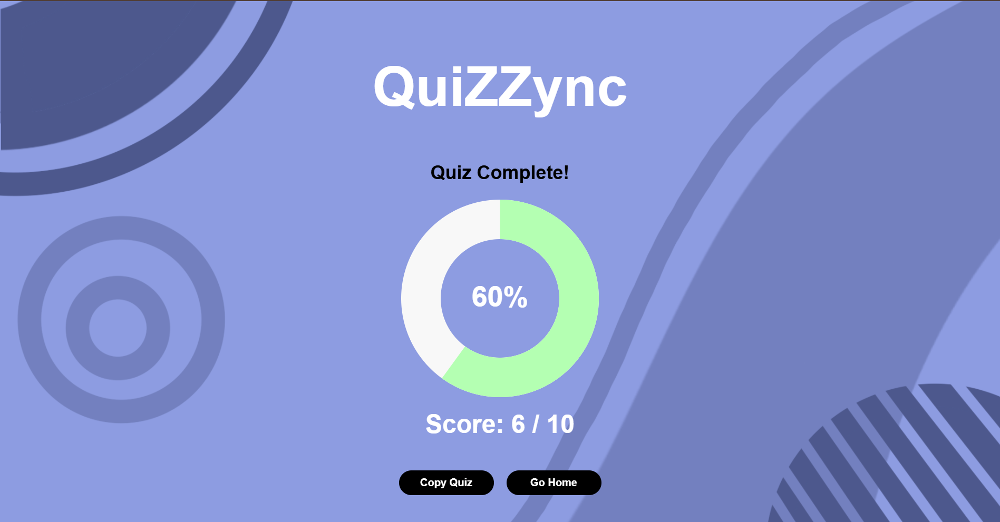

# 🧠 QuiZZync

**QuiZZync** is an AI-powered web app that generates Multiple Choice Questions (MCQs) from any given text, PDF, DOCX, or TXT file using Google Gemini API. The app supports mobile and desktop views and allows you to interactively take the generated quiz.

---

## App Link

[QuiZZync](https://qui-z-zync.vercel.app/)

---

## 🚀 Features

-  Generate MCQs from typed text or uploaded documents (.pdf, .docx, .txt)
-  Uses Gemini 2.0 Flash model for fast, reliable question generation
-  Interactive quiz with answer feedback and scoring
-  Mobile-friendly, responsive UI
-  Option to copy generated quiz to clipboard
-  Upload and parse PDF/DOCX using `pdfjs-dist` and `mammoth`
-  PNG background and floating buttons with modern design

---

## 🧰 Technologies Used

- React (with React Router)
- Google Gemini API
- Axios
- pdfjs-dist
- Mammoth.js
- Vercel (for deployment)

